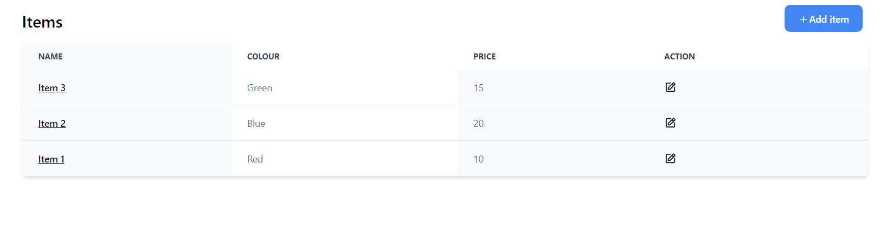
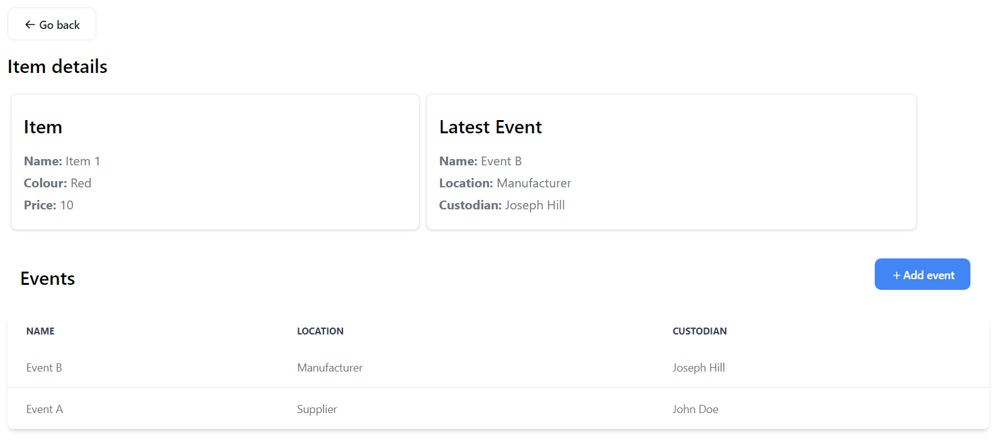

# Supply Chain Track & Trace System - Frontend

The Supply Chain Track & Trace System frontend is a user interface that provides a seamless experience for managing and tracking supply chain items and their associated events. It allows users to interact with the backend API to create new items, update item reference data, add events to items, and view information about items and events.

## Views

  

  

## Technologies Used

- React.js
- TypeScript
- React Query
- HTML5
- Tailwind CSS

## Getting Started

#### Prerequisites

- Node.js (v14 or higher)

#### Installation

1. Clone the repository: `git clone git@github.com:rOluochKe/supply-chain-frontend.git`
2. Run docker build: `docker-compose up --build`
3. Start app run: `docker-compose up`
4. Stop docker: `docker-compose down`

The frontend will be available at `http://localhost:3000`, and it will communicate with the backend API to fetch and update data.

## Features

- Create new supply chain items
- Update item reference data
- Add events to items
- View detailed information about items and their associated events
- Responsive and user-friendly interface
